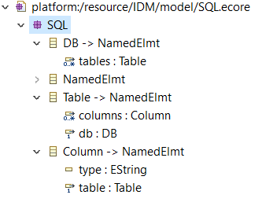
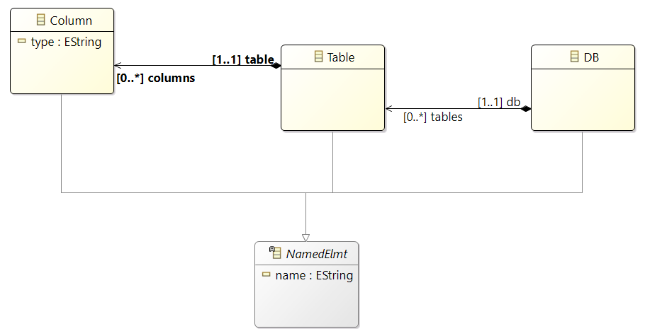

# Metamodeling with Eclipse/EMF (Eclipse Modeling Framework)

The objective of this practical work is to illustrate techniques of Model-Driven Engineering. The aim is to **enable the manipulation of relational database models** in different technological environments. 

To begin with, and to manipulate RDBMS models, a `DSL (Domain-Specific Language)` corresponding to an RDBMS must be built. It should allow the creation of SQL models without using tools such as MySQL, Oracle, or others.

In the second phase, for users working with NoSQL databases (a database management system that is not based on the classical relational architecture), a transformation from the SQL model to the XML model is necessary in order to leverage tools like BaseX.

This transformation uses an intermediary model conforming to the `KM3 metamodel` (proposed by INRIA). Thus, we carry out two transformations: first, a `model-to-model (M2M)` transformation from SQL to KM3, followed by a transformation from the KM3 model to an XML model. Finally, for users working with knowledge bases, a transformation from SQL to OWL is required. The resulting ontology (OWL model) can be used by ontology development tools such as Protégé.

The goal of these initial exercises is to get familiar with the tools provided by `Eclipse Modeling Tools` for meta-modeling. We will primarily use the tools developed as part of `Eclipse EMF (Eclipse Modeling Framework)`.

## Table of contents

- [Overview](#overview)
- [Setup](#my-process)
- [Creating the SQL metamodel](#creating-the-sql-metamodel) 
    - [Starting off with SQL.ecore](#starting-off-with-sqlecore)
    - [Classes, attributes and references](#classes-attributes-and-references)
    - [Visualizing the diagram](#visualizing-the-diagram)
- [Validating the Ecore model](#validating-the-ecore-model)
- [Constructing the Ecore metamodel](#constructing-the-ecore-metamodel)
- [Generate the Java code and the arborescent editor](#generate-the-java-code-and-the-arborescent-editor)
- [Use the arborescent editor](#use-the-arborescent-editor)
- [Creating the XML metamodel](#creating-the-xml-metamodel)
- [Creating the SQL text editor](#creating-the-sql-metamodel)

## Overview

    
    

## Setup

1. Here's a useful link where to find [`Eclipse Modeling Tools`](https://www.eclipse.org/downloads/packages/release/2022-12/r)
2. Unzip the downloaded file and execute the app `eclipse.exe` inside the folder
3. Change the perspective tab to `Ecore`
4. File > New > Other > Empty EMF Project > Next > Name of project: IDM > Finish

## Creating the SQL metamodel 

### Starting off with SQL.ecore

1. Create the Ecore file:
Right click model > New > Other > Ecore model > File name: 'SQL.ecore' 
2. When clicking on the file 'SQL.ecore', you can see an arborescence starting with an empty package. Click on that empty package and fill out its name (SQL), Prefix (SQL) and URI (ex. https://...)
3. Start creating EClasses, EAttributes, EReferences, ... in the arborescence to correspond to your designed model
    - ex. Right-click the package 'SQL' > New child > EClass

### Classes, attributes and references

- DB
    - ESuper Types: NamedElmt
    - EReference: tables
        - EType: Table
        - Containment: true
        - Upper Bound: -1

- Table
    - ESuper Types: NamedElmt
    - EReference: columns
        - EType: Column
        - EOpposite: Table
        - Upper Bound: -1

- Column: 
    - ESuper Types: NamedElmt
    - EAttribute: type
        - EAttribute Type: EString
    - EReference: table
        - EType: Table
        - EOpposite: Table
        - Lower Bound: 1
        - Upper Bound: -1

- NamedElmt: 
    - Abstract: true
    - EAttribute: name
        - EAttribute Type: EString

### Visualizing the diagram

1. Right-click 'SQL.ecore' > Initialize Ecore Diagram > Filename: 'SQL.aird' > Next
2. Type of representation: Entities in a Class Diagram
3. Select the package SQL > Finish
4. In 'SQL Class diagram', right-click > Add Related Elements > Select each class one by one to add them in the representation

## Validating the Ecore model

`Validation` is the process of checking the ecore model to ensure that it conforms to the constraints and rules defined by the Ecore metamodel, ensuring that our  model is syntactically and semantically correct, and catching potential issues that might prevent it from working properly.

- In 'SQL.ecore', right-click the root of the ecore model (arborescence)
- Select 'Validate'

From this, 3 new projects are generated:
- `.model project`: Contains the Ecore model itself and the generated code that corresponds to the metamodel
- `.edit project`: Provides editing support for the model. It contains generated code to build an item provider that allows you to view and edit instances of the model. Used by UI tools.
- `.editor project`: Contains a basic editor generated for the model, integrated into Eclipse.

## Constructing the Ecore metamodel

## Generate the Java code and the arborescent editor

## Use the arborescent editor

## Create the XML metamodel

## Creating the SQL text editor

