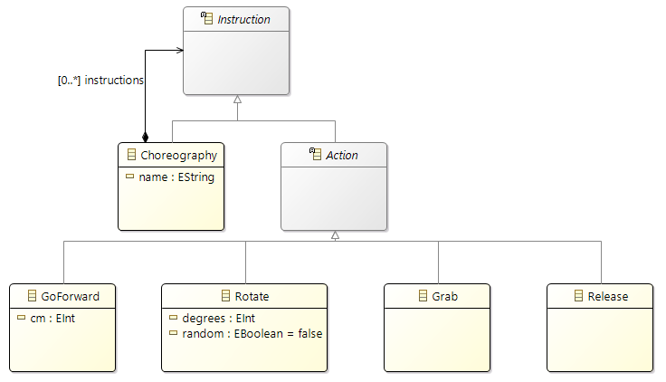

# Graphical editor with Sirius

The aim of this work is the creation of a Domain-Specific Graphical Modeling
Workbench with Eclipse Technologies. It summarizes the presentation of Obeo’s team during the International Conference on Model Driven Engineering Languages and Systems (Models 2016) that has been held in Saint-Malo, France.

## Table of contents

- [Sirius concepts](#sirius-concepts)
- [Step1: Metamodel](#step1-metamodel)

## Sirius concepts

During this workshop, we will mainly use these Sirius concepts:
- **Viewpoint Specification Project**
    - The Eclipse project that defines a Sirius modeling tool
    - Contains an `odesign` file that describes the representations and Java services used by the tool

- **Viewpoint**
    - A viewpoint defines Sirius representations (diagrams, tables, matrices, trees) dedicated to a specific need

- **Diagram Description**
    - Describes a kind of graphical representation for our model
    - It defines which elements to display on the diagram, how (style) and the tools to edit them

- **Node**
    - Describes model elements displayed via an image or a simple shape
    - It defines how to find the model elements to display
    - It defines a graphical style (shape, label, color, ...)

- **Relation Based Edge**
    - Describes the relationship between two objects
    - The relationship can be computed
    - It defines graphical style (color, routing style, ...)

- **User Colors Palette**
    - Defines specific colors that you can use for the diagram elements (background, foreground, border, ...)

- **Container**
    - Describes graphical model elements that can contain other elements (as free form, lists or compartments)
    - Defines how to find the container elements to display and their sub- elements (nodes, containers, ports)
    - Defines a graphical style (shape, label, color, ...)

- **Double-Click tool**
    - Defines which actions to execute when the user double-click on a graphical element

- **Direct Edit Label tool**
    - Defines how to interpret the label value changes that are made directly on the diagram

- **Properties Views Description**
    - Describes how model element properties are edited in the Eclipse Properties Views

## Step1: Metamodel

### Objective
Use Ecore Tools to create a metamodel that allows the description of a robot
choregraphy:
- The Ecore model
- The generated Java source code corresponding to the EMF implementation

    
    

### Text editor

**mindstorms.ecore:**

- Instruction: 
    - Abstract: true

- Choreography:
    - ESuper Types: Instruction
    - EAttributes:
        - name:
            - EAttribute Type: EString
            - EType: EString
    - EReferences:
        - instructions:
            - Containment: true
            - EType: Instruction
            - Lower Bound: 0
            - Upper Bound: -1
- Action:
    - ESuper Types: Instruction
    - Abstract: true

- Grab:
    - ESuper Types: Action

- Release:
    - ESuper Types: Action

- Rotate:
    - ESuper Types: Action
    - EAttributes:
        - degrees:
            - EAttribute Type: EInt
            - EType: EInt
        - random:
            - EAttribute Type: EBoolean
            - EType: EBoolean

- GoForward:
    - ESuper Types: Action
    - EAttributes:
        - cm:
            - EAttribute Type: EInt
            - EType: EInt

**Example choreography:**

    
    

